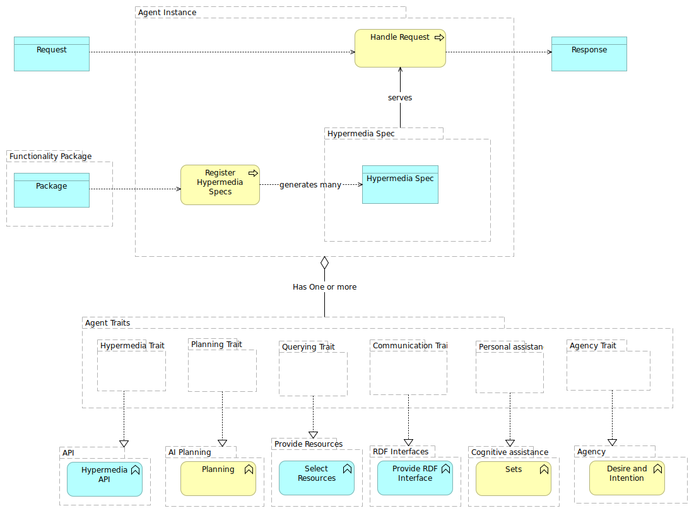

Some slides about functionalities of a simple HTTP-enabled personal agent

## Personal Agents

Personal Agents support the user in their daily activities without the need to explicitly tailoring each application. The agent can execute automated jobs but also personalizes software the user consumes by adapting HCI to the user’s context, composed by his data, environment and current tasks.

A personal agent incorporates functionality during the lifetime of a user, which is translated into better adaptations. I call these Functionality Packages.

## Distinct traits of an HTTP-enabled personal agent

Cristian Vasquez.
