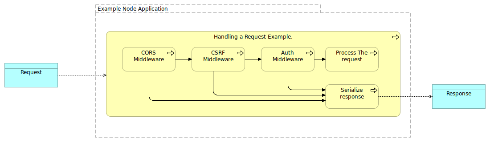

# Existing frameworks

Node HTTP Server

Node is a runtime environment that allows building all sorts of server-side tools. It omits browser-specific javascript while providing support for OS APIs, including HTTP and the file system.

In this example, I’ll use the popular framework Express. Express is used to build a web server that listens for any kind of HTTP request. You can add in the code with the specific handling for the different HTTP verbs, \(GET, POST, DELETE, etc\), serving static files or generating dynamically a response. Also, you can add what they call middleware to process a request in a pipeline.

In the figure, an example of a ‘Handle Request’ pipeline

